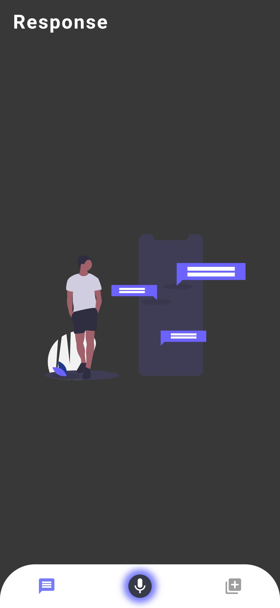
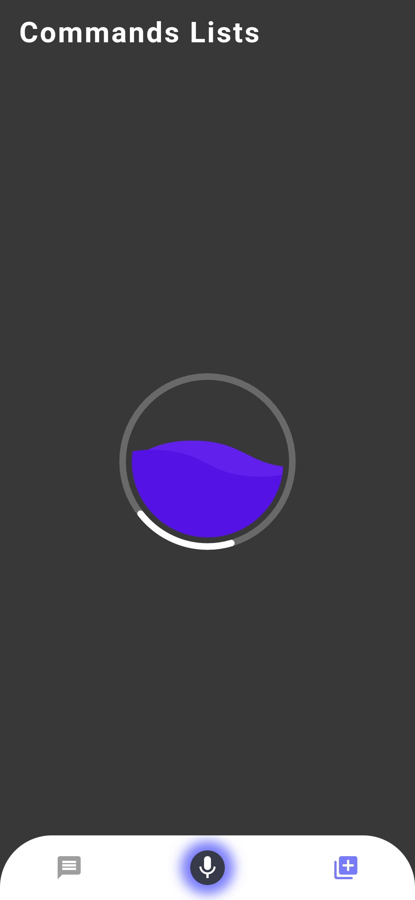
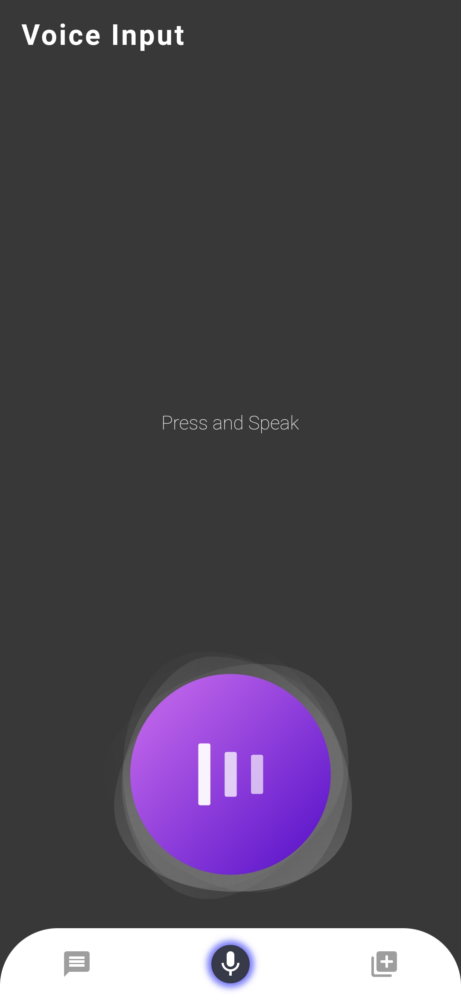

# CST3140 Novel Interaction
## Voice Based Application 

This project is a voice-based Flutter application which makes use of the [Google Api Console](https://developers.google.com/apis-explorer).
In the API Console, a project is a collection of settings, credentials, and metadata about the application which make use of Google APIs 
and Google Cloud Platform resources. The console manages certain project tasks, such as generating API credentials, enabling APIs, 
and managing team and billing information associated with a project.

**Youtube Data API V3**

##### Overview

The [YouTube Data API v3](https://developers.google.com/youtube/v3/docs/search) is an API that provides access to YouTube data, such as videos, playlists, and channels.

##### Search

A search result contains information about a YouTube video, channel, or playlist that matches the search parameters specified in an API request. While a search result points to a
uniquely identifiable resource, like a video, it does not have its own persistent data.

##### Methods

The API supports the following methods for search:

Returns a collection of search results that match the query parameters specified in the API request. By default, a search result set identifies matching video, channel, 
and playlist resources, but you can also configure queries to only retrieve a specific type of resource.

## Libraries Used

[Rive 1](https://github.com/2d-inc/Flare-Flutter) can also referred to as Flare

Rive offers powerful realtime vector design and animation for app and game designers alike. 
The primary goal of Flare is to allow designers to work directly with assets that run in their final product, 
eliminating the need to redo that work in code. 

[Speech To Text](https://github.com/csdcorp/speech_to_text)

A library that exposes device specific speech recognition capability.
This plugin contains a set of classes that make it easy to use the speech recognition capabilities of the mobile device in Flutter.

**Installation**

[flare_flutter 2.0.6](https://pub.dev/packages/flare_flutter)

[speech_to_text 3.1.0](https://pub.dev/packages/speech_to_text)

## Screenshots
  